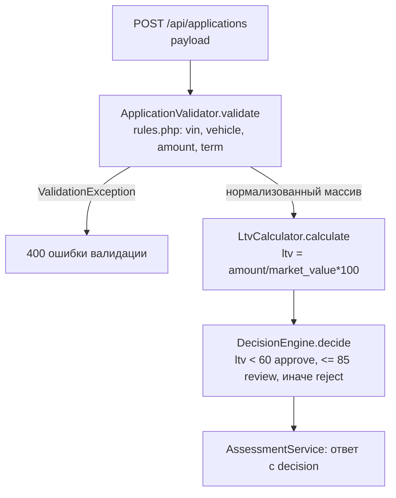

# Карта кода: как считается решение approve / review / reject

## Участвующие файлы и порядок вызова

Пайплайн собирается в `backend/src/AppFactory.php::create()` (строки 30–39): он загружает
`backend/config/rules.php` и собирает цепочку `ApplicationValidator → LtvCalculator →
DecisionEngine` внутри `AssessmentService`. Дальше всё управляется
`AssessmentService::assess()` (`backend/src/Domain/AssessmentService.php`):

1. **`ApplicationValidator::validate($payload)`** (`backend/src/Domain/ApplicationValidator.php`,
   строки 24–83) — нормализует и проверяет вход по справочнику из `rules.php`:
   VIN (`VinValidator::isValid`, пороги `vin.length` / `vin.forbidden_chars`), год выпуска
   (`VehicleAge::inYears` + `vehicle.min_year` / `max_age_years`), пробег
   (`vehicle.max_mileage_km`), оценочную стоимость, сумму (`amount.min`/`max`) и срок
   (`term.min_months`/`max_months`). При ошибках бросает `ValidationException`; иначе
   возвращает нормализованный массив, включающий `mileage`.
2. **`LtvCalculator::calculate($requestedAmount, $marketValue)`**
   (`backend/src/Domain/LtvCalculator.php`, строка 25) —
   `round(requested_amount / market_value * 100, 2)`, LTV в процентах.
3. **`DecisionEngine::decide(float $ltv)`** (`backend/src/Domain/DecisionEngine.php`,
   строки 30–41) — сравнивает LTV с порогами из `rules.php`
   (`ltv.approve_max = 60.0`, `ltv.review_max = 85.0`):
   - `ltv < 60` → `APPROVE`
   - `60 <= ltv <= 85` → `REVIEW`
   - `ltv > 85` → `REJECT`
4. `AssessmentService::assess()` формирует ответ: `vehicle_age` (через
   `VehicleAge::inYears`), `ltv`, `decision`, `approved_limit` (запрошенная сумма при
   `approve`, иначе 0).

Замечание: `rules.php` содержит ещё справочник `ltv_by_age`, но он в коде решения
**не используется** — сам конфиг и `AssessmentService` прямо говорят, что это задача LOAN-12.

## Куда встанет правило «пробег ≤ 400 000 км, иначе review»

Логика решения по LTV полностью сосредоточена в
`DecisionEngine::decide(float $ltv): string` — эта функция сейчас принимает **только** LTV
и про пробег ничего не знает. Вариант размещения:

- **Функция:** `DecisionEngine::decide()` — как отдельная проверка после LTV-порогов
  (или как ограничитель: если пробег > порога, решение не может быть `approve`, максимум
  `review`). Тогда сигнатура должна расшириться примерно до `decide(float $ltv, int $mileage)`,
  а конструктор — принять новый порог (например, `vehicle.review_max_mileage_km`) из
  `rules.php`. Точка вызова — `AssessmentService::assess()`, строка 33:
  `$decision = $this->decisionEngine->decide($ltv)` — туда нужно передать
  `$input['mileage']`.
- Альтернатива — новое условие прямо в `AssessmentService::assess()` после строки 33,
  но по конвенции проекта (правила в коде, числа в `rules.php`) место правилу — в
  `DecisionEngine`, а числу — в `rules.php`.

**Что уже есть из входных данных:**

- `mileage` есть в payload заявки, валидируется и возвращается
  `ApplicationValidator::validate()` (строки 43–46, 78), то есть в
  `AssessmentService::assess()` он доступен как `$input['mileage']`.
- Паттерн «порог из конфига передаётся в конструктор доменного класса» уже отработан
  (`DecisionEngine` получает `ltv`-пороги, `VinValidator` — `vin`-параметры).

**Чего не хватает:**

- Порога в `backend/config/rules.php` (числа 400 000 в конфиге нет; есть только
  `vehicle.max_mileage_km = 500000`).
- Передачи `mileage` в `DecisionEngine` (параметра функции и, при конфиг-подходе, поля
  конструктора).
- Логики в `DecisionEngine::decide()`, которая учитывает пробег. Сейчас такой логики нет.
- Тестов на это правило — нет.

## Что уже сейчас проверяется про пробег

Ровно одно: **`ApplicationValidator::validate()`**, строки 43–46 — пробег должен быть целым
от `0` до `vehicle.max_mileage_km` (`500000` из `rules.php`). Нарушение — это ошибка
валидации (`ValidationException`, поле `errors['mileage']`), то есть заявка вообще не
доходит до расчёта LTV и решения. Влияния пробега на выбор `approve` / `review` / `reject`
в коде **нет** — `DecisionEngine` про пробег не знает, справочника `ltv_by_mileage` или
аналогичного в `rules.php` тоже нет.
